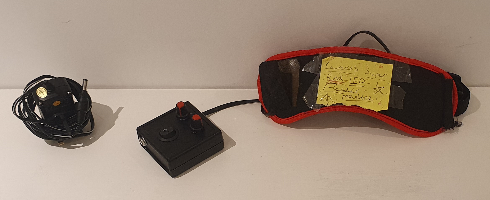

description: Other miscellaneous projects of mine that don't really need their own page.
---
{box}
{title}# Misc{end}
{body}
This page has a bunch of miscellaneous projects of mine that don't really need their own page.
{end}
{end-box}

{box}{body}
# jumbledFont

A little while ago I made a font. It was originally for this website, but it wasn't very readable. I don't really use it anymore, but I'd rather put it here than have it rot on my hard drive.

Each character is 10x20 pixels, with a 2 pixel gap between characters. For best results use it with a size of 16 with antialiasing disabled.

It doesn't have tons of glyphs, just the english alphabet, numbers, and some symbols!

Here's what it looks like in action:

## <a href="jumbledFont.ttf" download target="_blank">DOWNLOAD</a>

If you use it in anything, tell me! I'd love to hear :3

May 2022

{end}{end-box}

{box}{body}
# The Internet

"This, Jen, is the internet."

This is a prop of 'The Internet' from 'The IT Crowd'. It flashes just like the real thing!

I made this for my friends birthday last year as both him and I really like the show.

On the inside is an awfully soldered 555 timer circuit to control the light, as well as a 9v battery.

January 2023
{end}{end-box}

{box}{body}
# Flashing Eye Mask

My mum asked me to build her this, I don't really get why but of course I'm happy to help her out. Apparently it's soothing or calming or whatever, what's important is that she likes it!

It's made with an ATtiny microcontroller, and the two knobs control the brightness and speed of the flash.

April 2023
{end}{end-box}