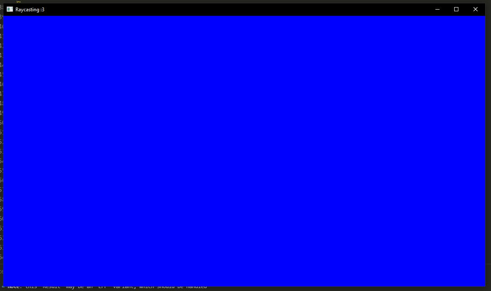
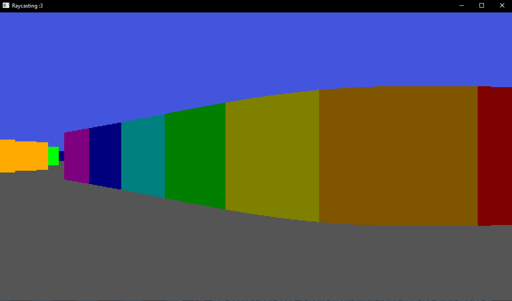
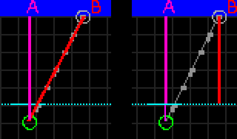
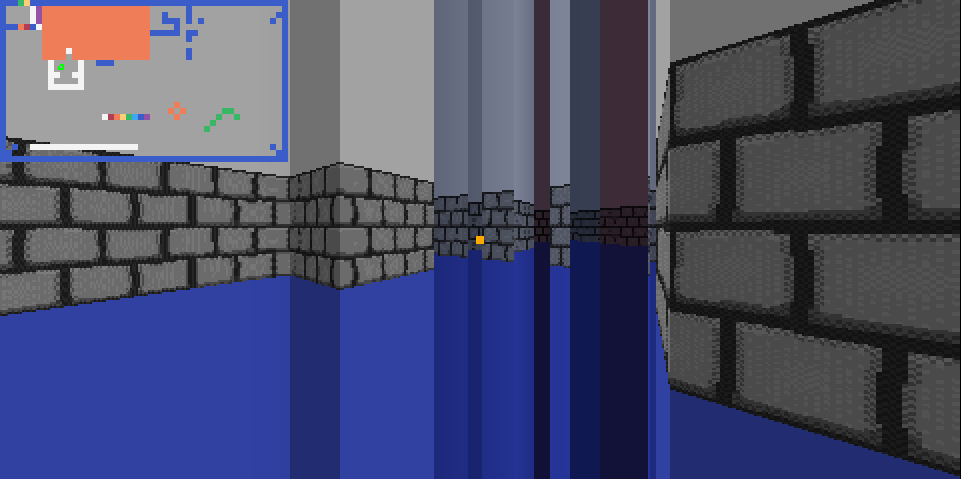

description: A little work-in-progress raycaster written in Rust, not finished but one day I'd love to get back to it!
---
{box}
{title}# Raycaster{end}
{body}
After a pretty large creative drought, I decided to start work on a little raycaster. It's not finished yet (and may never be..)

Here's what I've got so far!

{end}
{end-box}

{box}
{title}# Programming{end}
{body}
## The beginning...

I wanted to make this in my favourite programming language, Rust.

To start off with, I'd have to make a window. So, I had to pick a library.

I rifled through the many Rust libraries for this kind of thing, and settled on Pixels, which should be good as I'm making a software renderer and don't need things like sprites and other fancy abstractions.

Pixels basically gives you an array of colour values to do whatever you want with, which is perfect.

So, with pixels installed, I made my first window, nothing to write home about but, it works!

---

## Drawing a map

Before I made it 3D and all that jazz, I first implemented a 2d top-down view of the world. This made debugging and figuring out what to do much easier.

To draw shapes I used a nice crate called [pixels_primitives](https://github.com/fekie/pixels-primitives), which has a bunch of handy functions!

---

## Casting a ray

So, I have a simple 2d map implemented and rendered with all those lovely functions from before. The player (the green circle) points towards the mouse (the red circle) and casts a ray (it's hit point being shown as the larger, empty gray circle).

The smaller gray circles along the ray represent each step it takes forward to see if it's intersecting with the map.

Currently, this is a pretty naive approach. The ray moves a fixed amount forward each time, which works, but is bad!! It can easily miss corners and other parts of the map like so...

What we NEED is something that steps through a grid, taking the smallest number of steps without missing any squares, some kind of algorithm, and thankfully, such an algorithm exists! It's called the DDA algorithm, and many people much smarter than I have written about this exact topic.

Here are some links I found very useful:
- [javidx9 (AKA One Lone Coder)'s YouTube video](https://www.youtube.com/watch?v=NbSee-XM7WA)
- [This brilliant article by Lode Vandevenne](https://lodev.org/cgtutor/raycasting.html)
- [This equally brilliant article on permadi.com](https://www.permadi.com/tutorial/raycast/rayc1.html)

After implementing the DDA algorithm, the ray now never misses!

I also took the liberty of adding coloured cells and drawing some more useful debug info.

Just look at the way it handles corners, beautiful!

---

## Three dimensions!

Ok.. we have a reliable raycasting function, plus some general boilerplate, now to make it look 3D!

At first things were a bit goofy... 

But I ended up with this! It looks great! 

Ok.. I'm lying, that doesn't look good. It looks pretty awful actually! Aside from the poor choice of colours (I just wrote down hex codes without using a colour picker), it's all bulgy!!

What to do? Well, this is because we're getting the distance from the player to the wall, as opposed to the camera plane to the wall.

I drew a diagram and wrote an explanation, the diagram is nice so I'll keep it, but my explanation was awful. [Click here for a good one](https://www.permadi.com/tutorial/raycast/rayc8.html)

After applying this fix, as well as making the colours look way nicer, we have this! Beautiful! (This is using a modified version of the Sweetie 16 colour palette) 

And here it is in motion, with lovely head bobbing smooth movement! (The gif is a little bit choppy) 

---

## Brief tangent

I remembered a [video by Codeparade about raymarching](https://www.youtube.com/watch?t=231&v=svLzmFuSBhk&feature=youtu.be), and how you can make a world infinite by simply taking the modulus of the position of the ray.

I implemented this, making the world loop indefinitely, and thought it made a very neat effect! :3

---

## Textures

I'm gonna level with you, I think the plain version looks way nicer. It's so clean and stylised! However, textures are a super useful thing, and present in most raycasters, so I might as well at least attempt to add them.

You might notice that at the start of the page I'm showing off the untextured version. This is because I think it looks nicer, and the code for textures is still a little bit choppy (I tried to revamp the head-bobbing effect and some other polish, and now they don't work).

I made this weird debug texture (hadn't implemented texture loading yet so it was literally just an array of rgba values) and did some funny code and it works! 

Wait.. no it doesn't

This was a simple fix however, so I implemented it, added a nicer texture that I drew, and a minimap.

---

## Mirrors

I also tried adding mirrors, however this was in the span of about an hour, and I was tired and hungry. It's a wonder it even sort of works!

It also has weird graphics from when I was trying to debug things.

Honestly the mirror code was so awful, I reverted to the last commit and pretended it never happened.
{end}
{end-box}

{box}
{title}# Conclusion{end}
{body}
I know the explanations and examples are a little bit crude, I mention raycasting-related phrases and buzzwords and expect you to automatically know what I'm going on about.

This page isn't meant as a tutorial to anyone, more to document something I've been working on and make sure it doesn't just rot on my hard drive forever!

Please do check out the many links scattered around this page for intuitive and all round better explanations. <3

January 2024
{end}
{end-box}