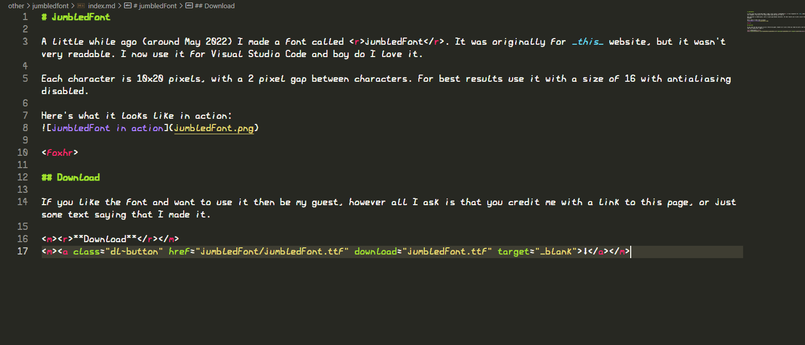

# jumbledFont

A little while ago (around May 2022) I made a font called <r>jumbledFont</r>. It was originally for _this_ website, but it wasn't very readable. I now use it for Visual Studio Code and boy do I love it.

Each character is 10x20 pixels, with a 2 pixel gap between characters. For best results use it with a size of 16 with antialiasing disabled.

It's currently incomplete and will remain that way for a while..!

Here's what it looks like in action:
<m><imgrs></m>

<foxhr>

## Download

If you like the font and want to use it then be my guest, however all I ask is that you credit me with a link to this page, or just some text saying that I made it.

<m><r>**Download**</r></m>
<m><a class="dl-button" href="jumbledFont/jumbledFont.ttf" download="jumbledFont.ttf" target="_blank">⬇</a></m>

