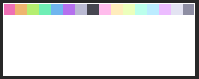
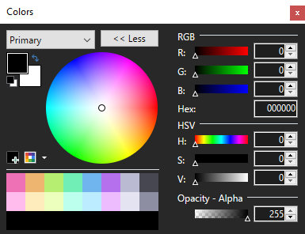

# Better Paint.net color palettes
## Downloads
| | | |
|-|-|-|
| [Sulu - jumbledFox](https://lospec.com/palette-list/sulu) | <ro> | <a class="dl-button" href="pdn-palettes/p-sulu.txt" download="sulu" target="_blank">⬇</a>
| [Sweetie 16 - GrafxKid](https://lospec.com/palette-list/sweetie-16)| <ro> | <a class="dl-button" href="pdn-palettes/p-sweetie-16.txt" download="sweetie-16" target="_blank">⬇</a>
| [Curiosities - sukinapan](https://lospec.com/palette-list/curiosities)| <ro> | <a class="dl-button" href="pdn-palettes/p-curiosities.txt" download="curiosities" target="_blank">⬇</a>

<foxhr>

## Why
While downloading a color palette from [Lospec](https://lospec.com/) is quick and easy, they're laid out rather inefficiently, like this:

Now, what I like to do is make custom layouts of the palettes we know and love, they make selecting colors alot quicker, and they're nicer on the eyes.

The problem with these is that they require color picker to be in 'big mode', I always have it like this so its no problem for me, but also you dont really need advanced color picking / manipulating options when you're using a palette... Oh well! It's part of my workflow, hopefully this page will help _someone_...

