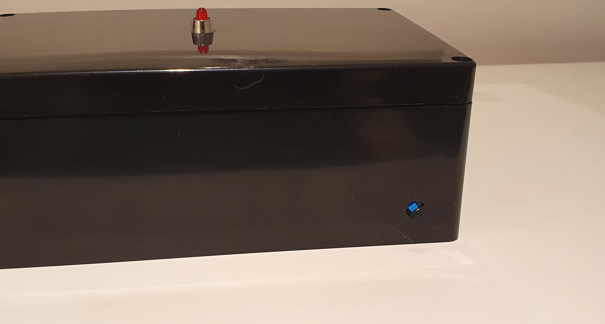
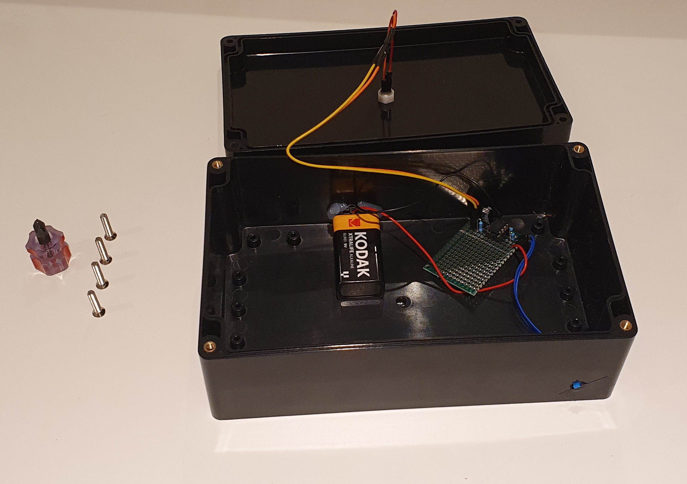
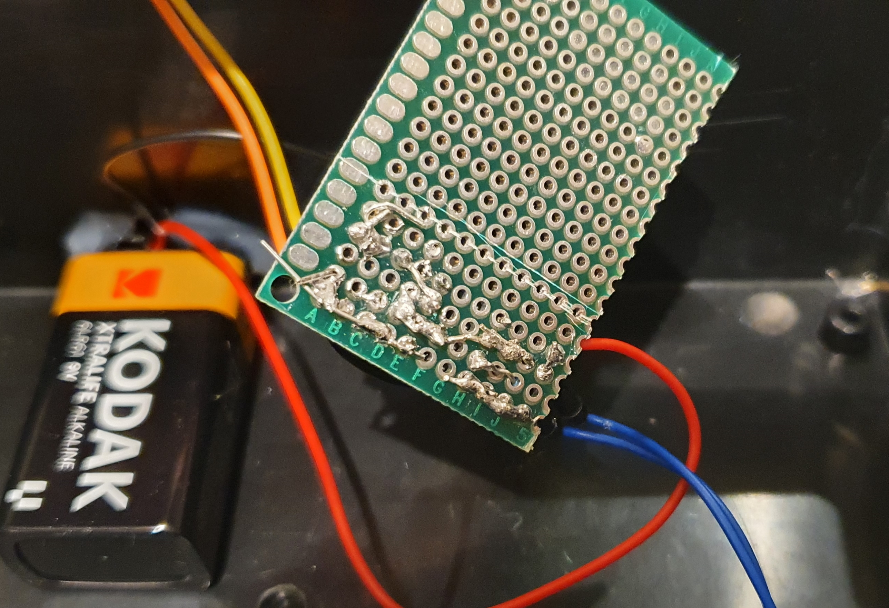

# The Internet
## This, Jen, is the internet.

<m><imgrs50></m>

This is the internet? The _whole_ internet? It's so small!

That's one of the surprising things about it. This is my homemade prop of <r>The Internet</r> from <r>The IT Crowd</r>.

This started out as just idea on around the 10th of January, and, with an awful lot of solder fumes and drill detritus, I managed to finish it a week later on the 17th.

<foxhr>

The sleek, modern form factor of the (slightly inaccurate to the show) [project box](https://www.amazon.co.uk/Waterproof-Electronic-Electrical-Enclosure-Screwdriver/dp/B09JK1QRJ4/ref=sr_1_10?keywords=black+project+box&qid=1673392271&sprefix=black+proj%2Caps%2C70&sr=8-10), combined with the beautiful, bezeled, bright red LED, would lead to _quite_ the response from the shareholders.

<m><imgrs></m>

On the back, along with some scratches, there's a small toggle.. latch.. push button.. thing (gonna be honest, I have no idea what it's called). A portion of the hole is covered with some kind of tape that I found, making it a bit more hidden and easier on the eyes.

<m><imgrs></m>

(? this photo is a bit warped for some reason)

<foxhr>

## THE GUTS

Taking a gander inside reveals an assortment of connections, with the centerpiece being the perfboard that holds the 555 timer circuitry.

<m><imgrs></m>

This perfboard is the first one I've ever soldered! It's not the best, but boy does it work!

<m><imgrs></m>

I used an 100 microfarad, 50v capacitor (put on the wrong way at first lol), as well two 10 kilohm resistors, these specific components do some funny things to the 555 timer, that somehow (magically) make its output pin stay on for around 1.4 seconds, and off for around 0.7. That other resistor is so the LED doesn't EXPLODE!!

<m><imgrs></m>

<foxhr>

To hold the button on the back in place, I used a mess of hot glue.

<m><imgrs50></m>

<foxhr>

This is being given to my friend Jacob for his birthday, as he likes The IT Crowd, and it costed about a tenner.

